1.  Jmeter utamanya melakukan performance testing. Jmeter menilai system performances dibawah workload tertentu. Test pada jmeter menyimulasikan user traffic dan mengukur performa seperti response time, throughput, dan concurrency. Jmeter fokus pada performa sistem di bawah workload tertentu. Hal ini biasanya berinteraksi dengan aplikasi melalui interface untuk menyimulasikan user actions. 
    Profiling menganalisis runtime behaviour, resource consumption, dan mengidentifikasi performa bottlenecks. Profiling memberikan informasi pada CPU usage, memory usage, method execution times, alokasi objek, dll. Profiling fokus pada aspek internal dari kode aplikasi dan runtime environment.

2. Proses profiling berguna untuk mengidentifikasi dan memahami kelemahan dari suatu aplikasi dengan memberikan insight terhadap runtime behaviour program. Profiling membantu menunjukkan area kode yang mengonsumsi resource paling banyak. Hal ini ditandakan melalui CPU time, memory, atau disk I/O.

3. Menurut saya ya, IntelliJ Profiler efektif membantu saya mengidentifikasi dan memahami kekurangan pada aplikasi saya. Karena dengan IntelliJ Profiler, bagian dari kode yang memakan sangat banyak resource serta memakan waktu dihighlight sehingga saya tau bagian mana dari kode saya yang perlu direfactor.

4. Tantangan utama yang saya hadapi ketika melakukan performance test adalah untuk memahami cara membaca hasil dari tesnya. 

5. Dengan fotur Profiler dari IntelliJ, saya jadi bisa mengetahui method serta bahkan line dari kode saya yang memakan banyak CPU time serta memory usage sehingga mudah untuk point out bagian kode yang perlu diperbaiki.

6. Jika hasil Jmeter dan IntelliJ Profiler, saya akan mencoba mencari di internet lalu menemukan bahwa cara menghandlenya:
    * Melakukan konfigurasi ulang test configuration
    * Memastikan environment seperti jaringan dan system configuration sama

7. Setelah menganalisis hasil dari performancetesting dan profiling adalah mengecek bagian kode yang tidak efektif lalu mengecek bagian kode yang lain yang berhubungan dengan kode tersebut lalu melakukan refactor. Dengan begitu saya dapat meminimalisir kemungkinan kode tersebut akan mengganggu kode yang lain.  
 

sebelum profiling
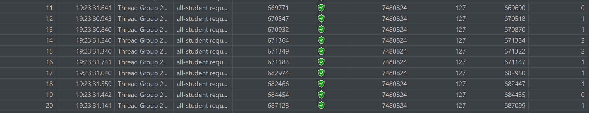
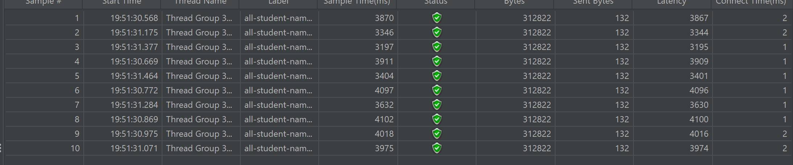
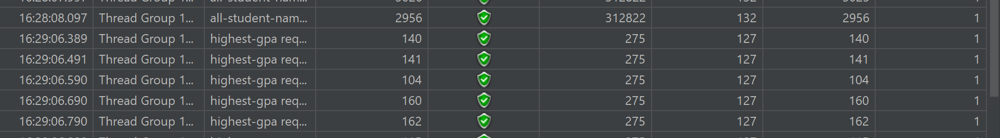
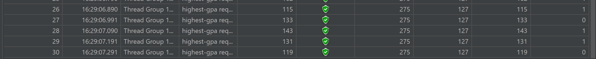
 
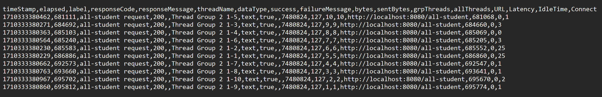
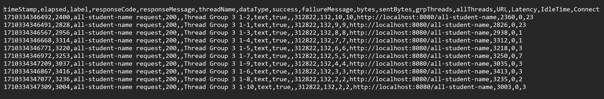
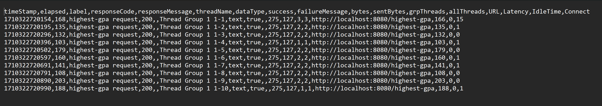
 
sesudah profiling

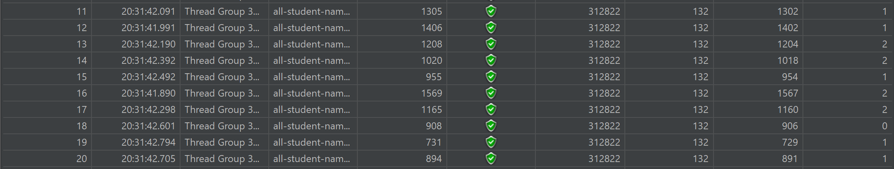
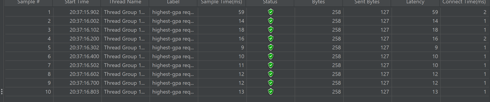
 
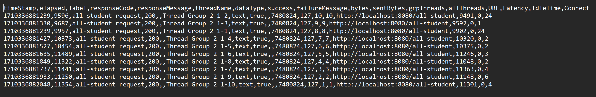
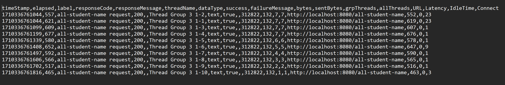
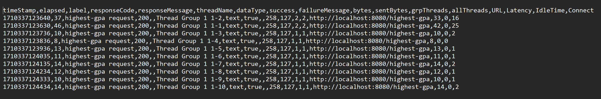